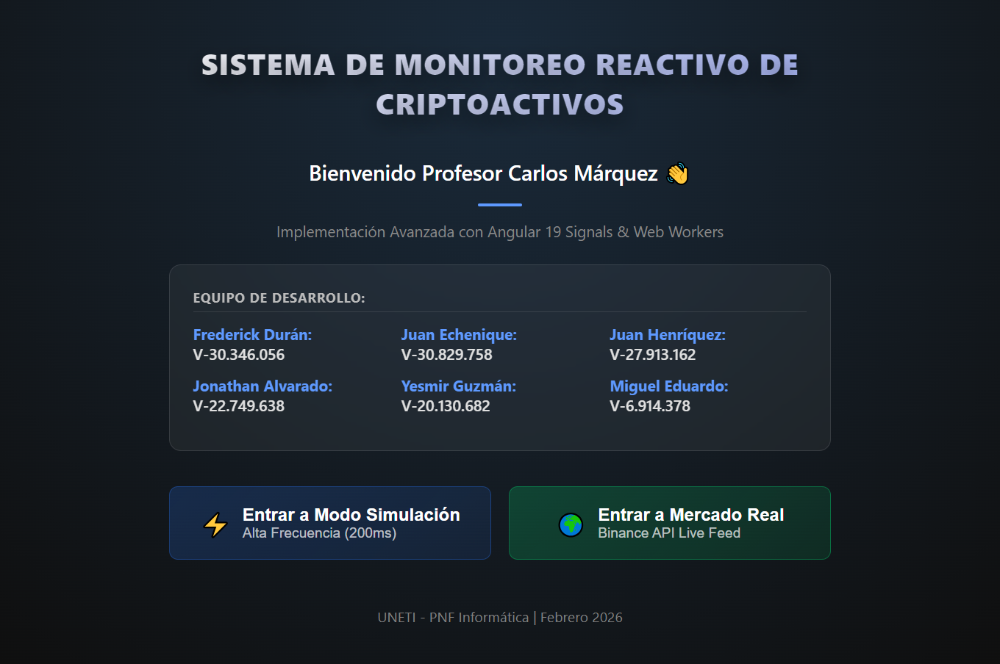
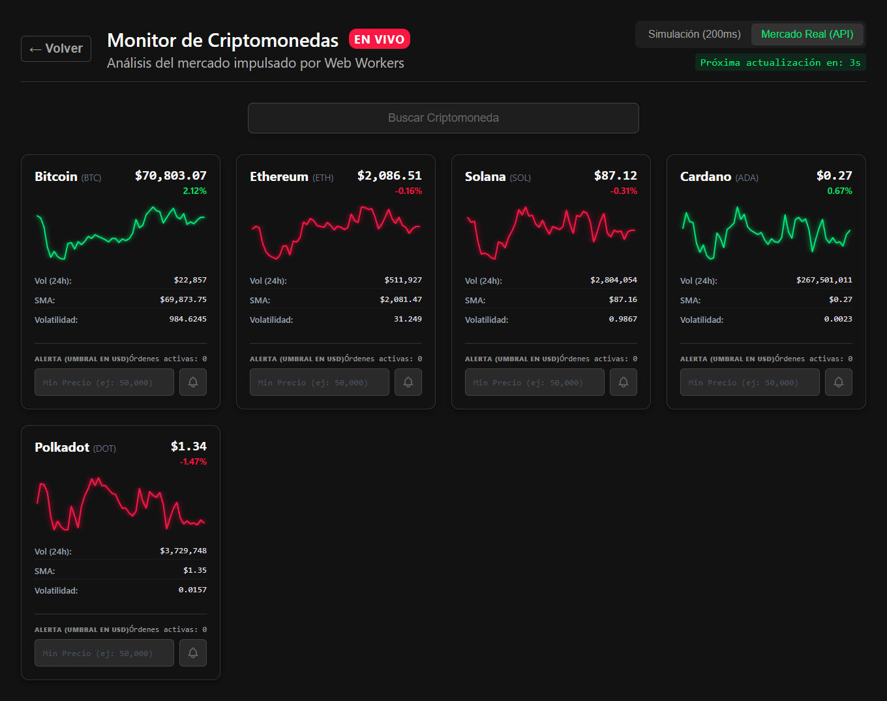

# 🚀 Plataforma de Monitoreo de Criptoactivos en Tiempo Real

> Sistema de monitoreo financiero de alta frecuencia (HFT) desarrollado con **Angular 21 (Experimental)**, **Signals** y **Web Workers**.



## 📖 Descripción del Proyecto

Este proyecto es una **Single Page Application (SPA)** diseñada para simular una terminal de trading profesional. Su objetivo principal es demostrar cómo manejar flujos de datos de alta velocidad (actualizaciones cada **200ms**) manteniendo una interfaz de usuario fluida a **60 FPS**.

Para lograr esto, hemos abandonado las técnicas tradicionales de detección de cambios en favor de una arquitectura reactiva pura basada en **Signals** y el procesamiento paralelo mediante **Web Workers**.

### ✨ Características Principales

*   **⚡ Rendimiento Extremo**: Actualización de precios en tiempo real sin bloquear la UI.
*   **🧠 Arquitectura Reactiva**: Uso exclusivo de **Angular Signals** para el estado de la vista (sin Zone.js overhead).
*   **🧵 Multithreading**: Cálculos matemáticos complejos (SMA, Volatilidad) delegados a un **Web Worker**.
*   **🎨 Diseño High Fidelity**: Interfaz "Cyberpunk/Neon" con modos de simulación y mercado real.
*   **📈 Gráficos SVG Nativos**: Sparklines generados matemáticamente en tiempo real sin librerías externas.
*   **🔔 Sistema de Alertas**: Monitoreo de precios con feedback visual instantáneo.

## 🛠️ Stack Tecnológico

| Tecnología | Versión | Propósito |
| :--- | :--- | :--- |
| **Angular** | v21 (Exp) | Core Framework & Signals |
| **TypeScript** | v5.9 (Beta) | Tipado Estático Avanzado |
| **BInance API** | v3 | Fuente de datos para mercado real |
| **Web Workers** | API Nativa | Procesamiento en segundo plano |
| **SCSS** | Dart | Estilos modulares y temas |
| **Vite** | Latest | Build System de nueva generación |

## 📂 Estructura del Proyecto

Organización modular siguiendo los principios de **Smart & Dumb Components**:

```bash
src/
├── app/
│   ├── core/
│   │   ├── models/          # Interfaces (CryptoAsset, WorkerData)
│   │   ├── services/        # CryptoDataService (Data Feed)
│   │   └── workers/         # crypto-processor.worker.ts (Lógica Matemática)
│   ├── features/
│   │   └── dashboard/       # Smart Component (Orquestador)
│   └── shared/
│       ├── components/
│       │   └── crypto-card/ # Dumb Component (Presentacional - SVG Sparklines)
│       └── directives/      # highlight-change.directive.ts (Optimizaciones DOM)
```

## 🚀 Instalación y Ejecución

Sigue estos pasos para levantar el entorno de desarrollo:

1.  **Clonar el repositorio**:
    ```bash
    git clone https://github.com/tu-usuario/crypto-angular.git
    cd crypto-angular
    ```

2.  **Instalar dependencias**:
    ```bash
    npm install
    ```

3.  **Iniciar el servidor de desarrollo**:
    ```bash
    npm start
    ```

4.  **Abrir en el navegador**:
    Visita `http://localhost:4200/` para ver la aplicación en acción.

## 🧪 Modos de Operación

La plataforma cuenta con dos modos de funcionamiento seleccionables desde el Dashboard:



1.  **⚡ Modo Simulación**: Genera un flujo de datos sintético local para pruebas de estrés y validación de la UI (Ideal para demos offline).
2.  **🌍 Mercado Real**: Se conecta a la API pública de Binance para mostrar precios reales de BTC, ETH, SOL, etc.

## 👥 Equipo de Desarrollo

Proyecto desarrollado para la unidad curricular **Programación III** - UNETI (Trayecto 3).

| Estudiante | Cédula | Rol |
| :--- | :--- | :--- |
| **Frederick Durán** | V-30.346.056 | Lead Architect & Signals |
| **Juan Echenique** | V-30.829.758 | UI/UX & Styles |
| **Juan Henríquez** | V-27.913.162 | Web Workers Implementation |
| **Jonathan Alvarado** | V-22.749.638 | Data Layer Service |
| **Yesmir Guzmán** | V-20.130.682 | Documentation & QA |
| **Miguel Eduardo** | V-6.914.378 | Integration Testing |

---

<p align="center">
  Hecho con ❤️ y ☕ usando <strong>Angular 21</strong>
</p>
